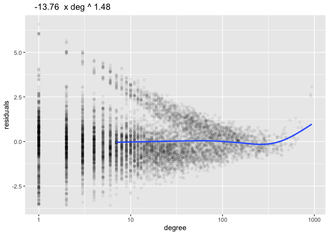

A Localization Diagnostic for Spectral Graph Analysis
================
Karl Rohe
7/17/2020

This creates a plot to diagnose localization in the spectral analysis of
graphs. Here is a simple simulation to illustrate the code.

First load the functions in
KeyFunctionsForDiagnosticPlots.R.

``` r
source("https://raw.githubusercontent.com/karlrohe/LocalizationDiagnostic/master/KeyFunctionsForDiagnosticPlots.R")
```

``` r
## install fastRG to simulate sparse graphs.
# install.package("devtools")
# devtools::install_github("RoheLab/fastRG")
library(fastRG)
library(rARPACK)
```

In this simulation, feel free to adjust the average node degree, number
of nodes, and distribution of the graph.

``` r
avg_deg = 30
n = 10^4

theta = rexp(n)^2  # this is the shape of the degree distribution.
set.seed(1)
A =chung_lu(theta, avg_deg = avg_deg, simple = T)+0
```

In practice, you would want to use your sparse adjacency matrix that you
have from your data.

Now, we can compute the necessary statistics to create the diagnostic
plot.

``` r
degree = rowSums(A)
ei = eigs(A, 5)
leverage = rowSums(ei$vectors^2)
```

The diagnostic plot function is called `plotDegLev`. It is computed with
the degree and the leverage.

``` r
plotDegLev(degree, leverage)
```

<!-- -->

In this simulation, the line bends up. This indicates localization
(bad\!) on the high degree nodes. We also see some localization on some
low degree nodes because there is more than one “cluster” of leverage
scores for the low degree nodes. These clusters appear as separate point
clouds. This localization is an artifact of noise. It does not represent
“signal”.

Instead of computing leverage on all of the eigenvectors, you can do it
for each eigenvector individually. Often when there is localization, not
all of the eigenvectors localize, only some.

You can compute the \`\`leverage’’ of one eigenvector by squaring each
element of the vector.

``` r
leverage = ei$vectors[,1]^2
plotDegLev(degree, leverage)
```

<!-- -->

In this simulation, the first eigenvector does not localize\! You can
see that all of the points are nicely on a straight line, both at low
degree and high degree. However, the second/third do localize.

``` r
leverage = ei$vectors[,2]^2
plotDegLev(degree, leverage)
```

<!-- -->

``` r
leverage = ei$vectors[,3]^2
plotDegLev(degree, leverage)
```

<!-- -->

You can also make these plots for the regularized graph Laplacian. This
can give different results\! In this case, it does give different
results.

``` r
ei = eigsL(A, 5)  # eigsL is defined in KeyFunctionsForDiagnosticPlots.R 
leverage = rowSums(ei$vectors^2)

# This plot does not display that upward tilt.
plotDegLev(degree, leverage)
```

<!-- -->

The eigenvectors of the regularized graph Laplacian do not localize in
this simulation. We see this because the line bends down. This is
great\! Bending up reveals localization. Bending down is ok (as far as I
know\!).

The leverage computed with all of the eigenvectors revealed that there
is no localization. As such, it is not necessary to compute it with each
individual eigenvector (as was done above).
